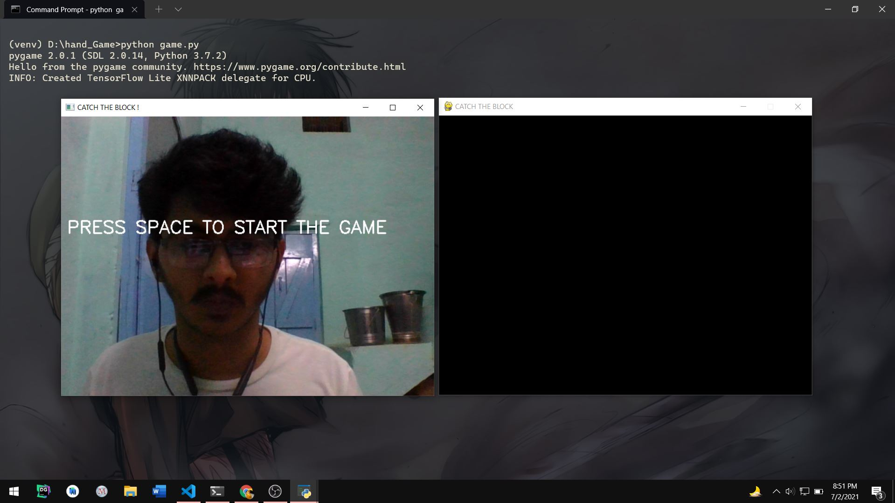
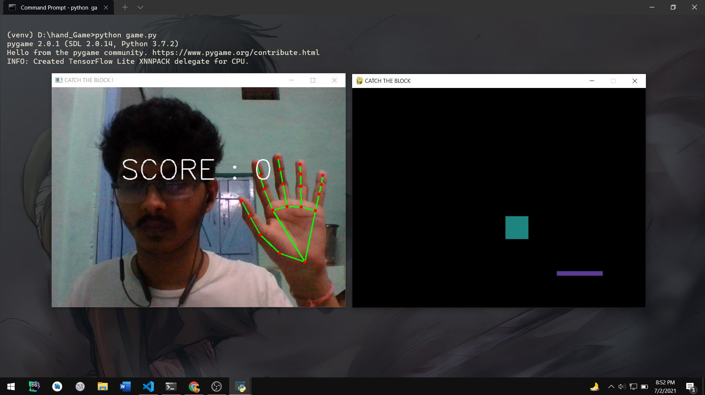

# CATCH THE BLOCK

The Project is made using Pygame + OpenCV.
I used the Mediapipe Library for Hand Tracking in OpenCV and used the Co-Ordinates of the Index Finger to Control the Horizontal Motion of the Player(Rectangle on Bottom of Screen).

## Demo






## Run Locally

- Clone the Repository
  ```bash
  git clone https://github.com/ish-u/Catch-The-Block-init-5.git
  cd Catch-The-Block-init-5
  ```
- Create a Virtual Environment and install Packages using PIP
  ```bash
  python -m venv venv
  venv\Scripts\activate
  pip install -r requirements.txt
  ```
- Run the Game
  ```
  python game.py
  ```
